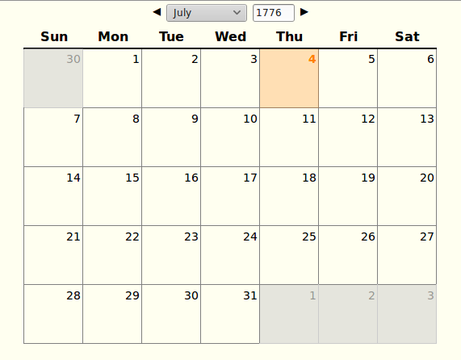

# lil-calendar

- **[Demo](http://remoteaddr.xyz/calendar)**

This is a lil calendar. It's static HTML driven by client-side
JavaScript. I made it because sometimes I need to view a simple
calendar online and all the other calendar sites have ads and 
stuff I don't care about, like a dialog nagging you to set up
an email reminder (wtf).

All this one does is sit there and look like a calendar.

It supports whatever dates the 
[JavaScript Date object](https://developer.mozilla.org/en-US/docs/Web/JavaScript/Reference/Global_Objects/Date) 
supports, which apparently is 

> -100,000,000 days to 100,000,000 days relative to 01 January, 
> 1970 UTC.

You can also "bookmark" a date by putting it in the hash,
e.g. [#1776-07-04](http://remoteaddr.xyz/calendar#1776-07-04).

